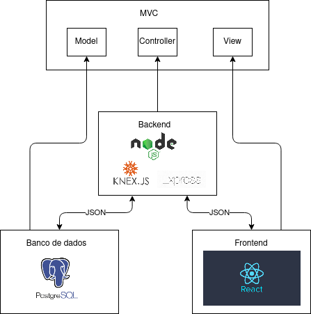
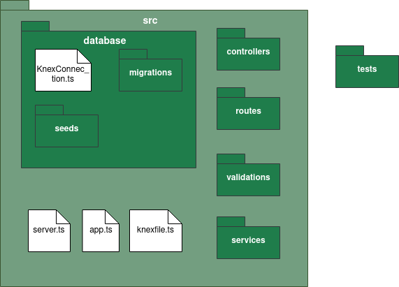
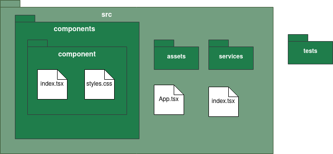
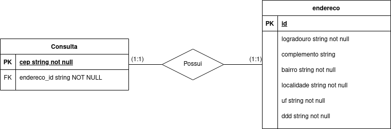

# Documento de arquitetura

## Objetivos 

Este artefato tem o objetivo de fornecer uma visão geral da arquitetura do DiscoverCEP. Apresenta várias visualizações de arquitetura para descrever os diferentes aspectos do sistema.

## Escopo

O DiscorverCEP é uma aplicação web que proporciona a descoberta de endereços a partir do CEP.

## Representação arquitetural

### Implementação

O modelo de arquitetura proposto no projeto é um modelo multicamadas, sendo composto por três camadas principais:

* **Visão:** camada em que os dados são visualizados a partir de uma interface gráfica implementada.
* **Controladora:** camada em que há o tratamento e interpretação dos eventos gerados por dispositivos de entrada.
* **Modelo:** camada que há persistência dos dados, sendo composta pelo banco de dados.

A comunicação entre as camadas é feita pelo modelo de arquitetura cliente-servidor. O servidor é responsável pela camada intermediária (Controladora), sendo responsável por lidar como a camada de persistência(Modelo), que fornece os dados para a manipulação, e com a camada de visualização (Visão), que representa por meio da interface gráfica os dados manipulados,  no qual são requisitados por meio do protocolo de comunicação ‘http’ com as outras camadas, e é utilizado JSON como a estrutura das informações sendo transmitidas. O usuário neste modelo realiza as requisições interagindo com a interface gráfica. 

* **Node.js:** Pode ser definido com um ambiente de execução Javascript server-side, sendo possível rodar uma aplicação standalone em uma máquina, não dependendo de um browser para a execução.

* **ReactJS:** Biblioteca JavaScript com foco em criar interfaces de usuários em páginas web.

* **Express JS:** Framework para Node.js, utilizado no back-end para o gerenciamento de rotas, middleware e de outras funções, facilitando a criação de API 's. Sendo responsável por realizar a conexão entre as camadas de persistência e de controle com a camada de visão.

* **Knex:** É um construtor de requisições para banco de dados com o modelo relacional(SQL).

* **PostgreSQL:** O banco de dados escolhido para o projeto.

### Back-end

Rotas do backend

* ``/v1/consulta/:cep``

Estrutura de pacotes do back-end.

* `src`

  Contém os arquivos de código fonte do back-end.

* `src/knexfile.ts`

  Contém as configurações da conexão entre o banco de dados e a aplicação.

* `src/server.ts`

  Habilitação das variáveis de ambiente, e ativação do back-end em uma porta. O "início" da aplicação.

* `src/app.ts`

  Habilitação de middlewares padrão à todas as rotas da aplicação, além da criação de rotas bases para os end-points.

* `src/database`

  Contém as lógicas de interação com o banco de dados, além disso a conexão com o banco de dados no arquivo `KnexConnection.ts`. Os código fonte dessa pasta utilizam o Knex para essa interação.

* `src/database/migrations` 

  Contém as lógicas de criação e exclusão de tabelas no banco dados de dados, chamadas de migrations. A ativação dessas tabelas é feita por meio do terminal utilizando ``yarn knex migrate:latest``, foi criado um script no yarn que simplifica o comando ``yarn knex:migrate``, ainda as migrations são rodadas automaticamente ao subir os contêineres com o docker-compose.

* `src/database/seeds` 

  Contém arquivos para população inicial do banco, utilizado principalmente para testes. A ativação dessas tabelas é feita por meio do terminal utilizando ``yarn knex seed:run``, foi criado um script no yarn que simplifica o comando ``yarn knex:seed``. As seeds são inseridas automaticamente ao subir o container.

* `src/controllers`

  Contém as lógicas de inserção e atualização de dados em tabelas, além de certas validações de dados simples. Os erros gerados nas controllers são tanto erros relacionados a essas validações como erros de operações no banco de dados.

* `src/routes`

  Criação das rotas de cada end-point, a partir da rota são chamadas as controllers requiridas, além dos middlewares de validação.

* `src/validations`

  Contém os middlewares de validação de requisição e de autorização.

* `tests`

  Contém os testes do back-end.

### Front-end
Estrutura de pacotes front-end.

* `src`

  Contém os arquivos de código fonte do front-end.

* `src/index.tsx`

  Página que realiza a inserção do javascript no elemento raiz do HTML, o "início" da aplicação.

* `src/App.tsx`

  Contém o elemento de roteamento da ``react-router-dom`` e os provedores de contexto mais externos ao código.

* `src/services`

  Concentra as lógicas de acesso às APIs tanto do back-end quanto APIs externas.

* `src/contexts`

  Contém os contextos de informações utilizadas em múltiplas páginas, como por exemplo, informações básicas de um usuário logado.

* `src/tools`

  Contém lógicas simples que auxiliam a formatar dados, como por exemplos, conversores de datas em string.

* `src/assets`

  Contém imagens e ícones utilizados na aplicação além de estilos CSS globais.

* `src/routes`

  Contém lógicas relacionadas ao roteamento da aplicação, selecionando qual component inserir de acordo com o URL, e também lida com a questão de autenticação.

* `src/components`

  Contém os componentes React criados.

* `src/components/Layouts`

  Contém componentes que formam layouts de páginas.

* `src/components/IndividualComponents`

  Contém componentes individuais que não formam um layout

* `src/components/Forms`

  Contém componentes de formulários, utilizando o Formik. Diferente de outros componentes há um arquivo a mais nas pasta dos componentes, que é o arquivo ``formSettings.ts``, que contém a lógica de estado, validação e submit dos formulários Formik.

### Banco de dados
Modelagem da estrutura do banco de dados

## Metas e restrições arquiteturais

### Metas

* **Desacoplamento:** A separação do software em duas frentes: interface de usuário (front-end) e API (back-end), facilitará para a equipe de desenvolvimento a divisão de tarefas necessárias para a construção do software. Além disso, permite escolher as melhores soluções tecnológicas para a implementação de cada frente. Além disso, no front-end deve-se priorizar a componentização.

## Qualidade

Na interface de usuário, a utilização do React permitirá que o desenvolvimento seja realizado de forma eficiente e componentizado, com facilidade de integração com outras bibliotecas e serviços.

No back-end, deve-se garantir a separação do acesso ao banco de dados de outras lógicas associadas ao backend.

Haverá a utilização do [Sonar Cloud](https://sonarcloud.io) para avaliação da qualidade de código além da utilização do [CodeCov](https://about.codecov.io/) para avaliação da cobertura de código, ambos dentro da pipeline de CI utlizando o github actions.

## Histórico de versão

| Data | Versão | Descrição | Autor |
| ------ | ---------- | ------------- | -------- |
| 20/05/2021 | 0.1 | Criação do documento | Júlio César Schneider Martins  |
| 24/05/2021 | 1.0 | Finalização do documento | Júlio César Schneider Martins  |
